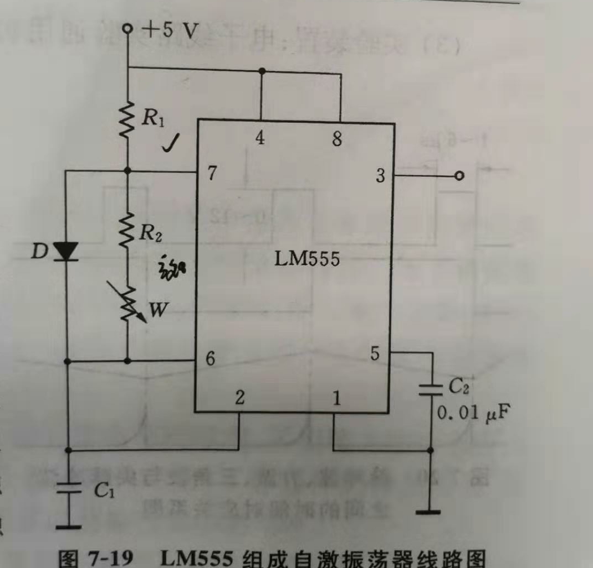

# 载波
基带信号具有较低的频率分量，只有经过高频载波的调制之后，才能通过无线信道进行传输。  
格力空调YB0F2型号遥控器使用的载波频率是38KHz，占空比1/2. 即载波高电平时间和低电平时间都是13.16us，允许略微偏差。  

## 载波发生方式
1. 据说esp8266的GPIO14管脚可以产生标准的38KHz，占空比1/2的载波，我之前尝试过，效果不好，空调无法识别，也许是我某个地方没有配置好，这个方案保留。  
2. 我使用的第二个方案是将控制命令从esp8266通过串口发送给其他的单片机，利用单片机的高精度定时器资源产生载波，这个方案完全可行，但是esp8266作为一个SoC，本身就是一块处理器，这样未免累赘。且进行系统升级时，需要同时修改esp8266和单片机的固件，比较麻烦。  
3. 因此我现在选择使用硬件方式产生载波，用一个555定时器，外接电阻、电容产生38KHz方波信号，555芯片有一个RST引脚。RST接高电平时，输出方波；接地时输出低电平，这样就实现了调制。  

## 555定时器原理图

注意上图中二极管D的作用十分重要，如果不接这个二极管，那么振荡器输出高电平的时间与R1+R2有关，低电平时间与R2有关。这样在调节电位计W时会同时改变振荡器输出频率与占空比。接入二极管之后，

**高电平时间**:	$t_1 = 0.693R_1C_1$  
**低电平时间**:	$t_2 = 0.693(R_2+W)C_1$  

这样，可以方便地调节占空比和周期。经过测试，R1=1.1K,R2=1.8K时可以产生所需要的载波，因此，将原理图中R1用510欧姆定值电阻和1K精密电位计替换，R2用1.3K定值电阻，W用1K精密电位计，C1取0.01uF.  
*这里两个电阻和电位计的取值可能需要你用面包板搭个电路进行测试，然后用示波器或者逻辑分析仪观测，不断尝试以得出电阻的合适取值，似乎不同的芯片略有区别，实际电路和Multisim仿真也略有区别*

*有的地方会说格力空调占空比为1/3，可能指的是调制占空比，即传送符号"1"时，脉冲持续时间(560us)占低电平时间(1680us)的1/3；  
也有的地方提到说“NEC协议载波占空比推荐为1/3或1/4”，但是格力空调使用的并不是标准的NEC协议。*

# 友情链接
[红外线发射的最佳占空比-百度知道提问](https://zhidao.baidu.com/question/469841290.html)  
[利用555定时器实现38KHZ方波的输出](https://blog.csdn.net/nausicaaaa/article/details/5597119)  
[Fritzing电路图](../Fritzing_Proj/)  
[Multisim12.0仿真](../Multisim_Proj/)