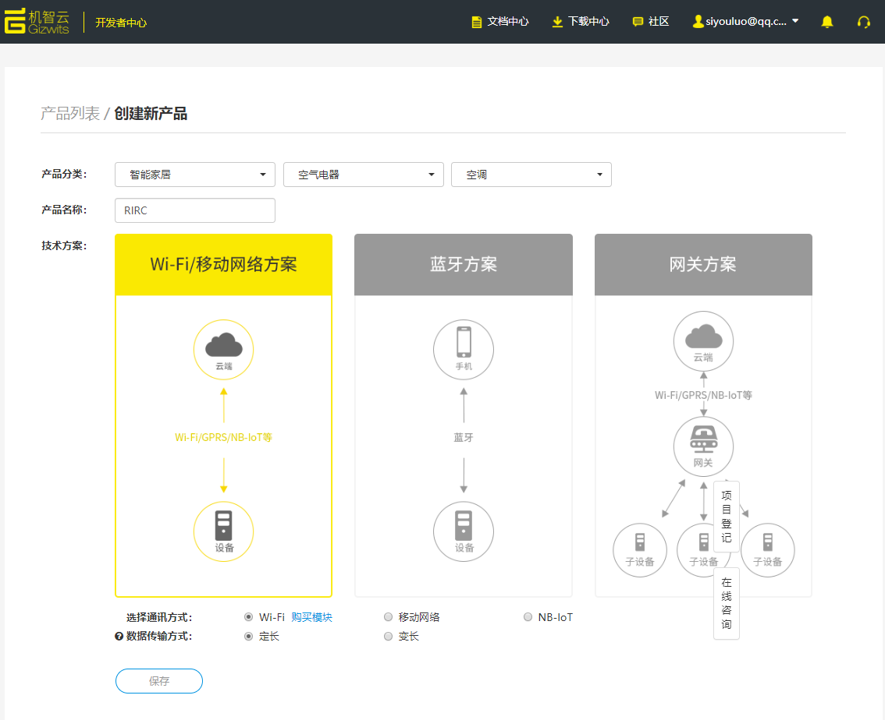
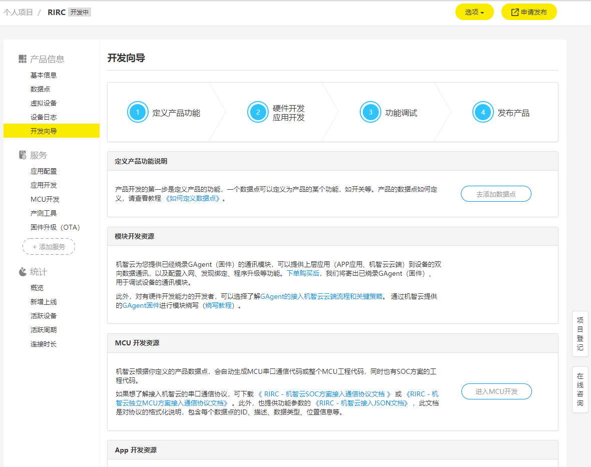
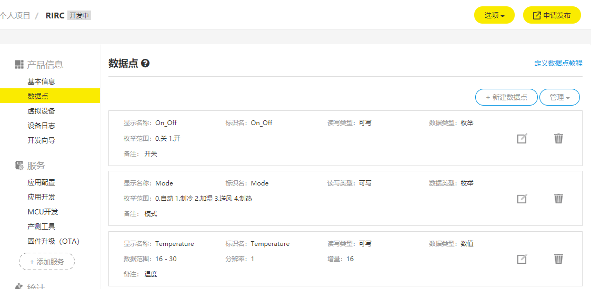
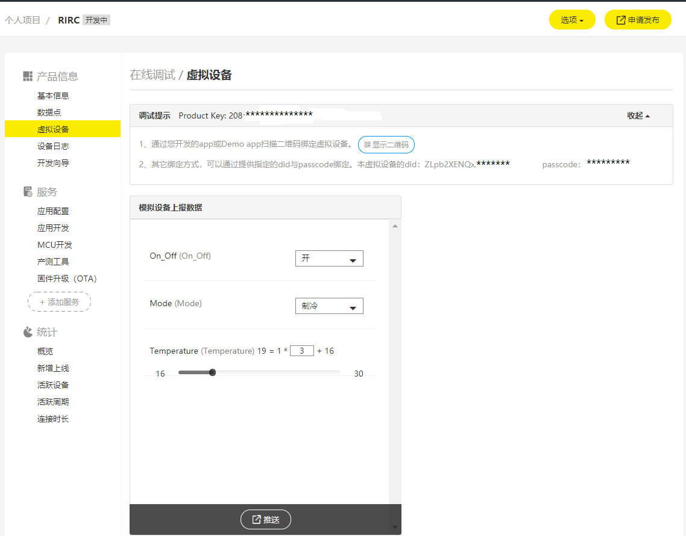
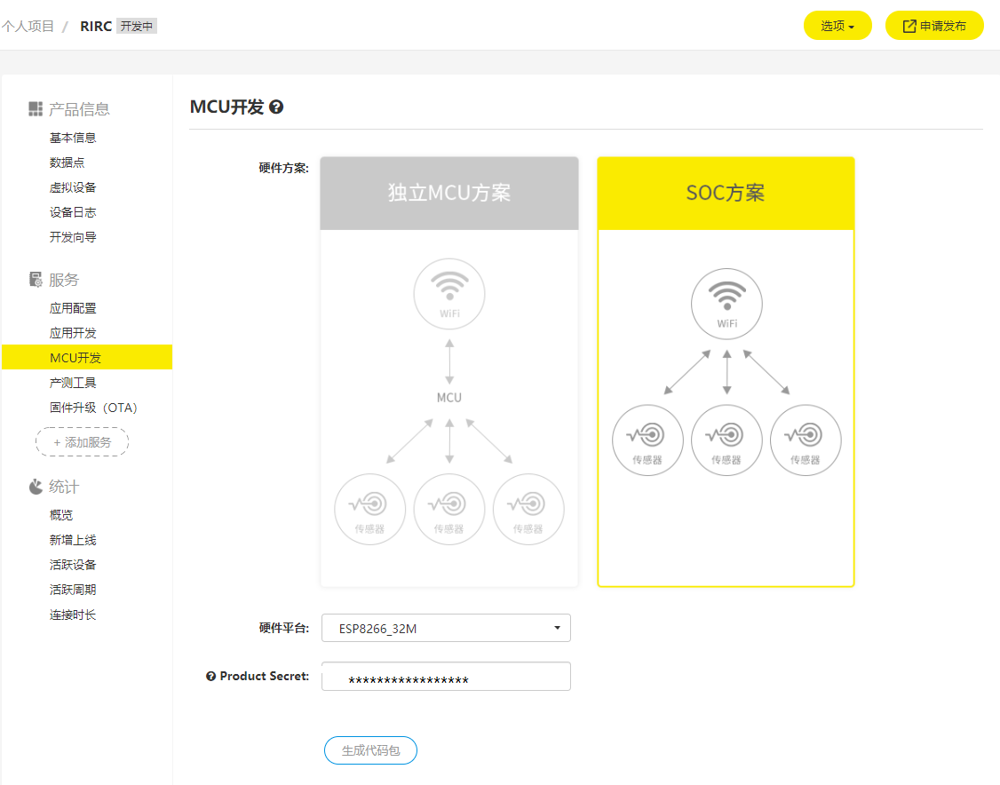

# ESP8266 PROJECT

# 开发流程

## 注册开发者账号
访问[机智云开发者中心](https://dev.gizwits.com/zh-cn/developer/)，注册开发者账号并登录  
<div align=center></div>  

## 创建产品
创建新产品，选择产品分类、名称、技术方案等  
<div align=center>  </div>

## 添加数据点
> 数据点是一套机智云设备通信协议，用于描述设备功能及其参数  

[如何定义数据点-官方教程](http://docs.gizwits.com/zh-cn/quickstart/datapoint_tutorial.html)  
<div align=center></div>

## 虚拟设备
> 通过虚拟设备模拟真实设备上报数据的行为，可以快速验证接口功能的开发。
> 用您开发的app或 下载Demo App 绑定虚拟设备，即可对虚拟设备进行远程控制及查看通讯日志。

下载[demo App](https://download.gizwits.com/zh-cn/p/98/99), 点击启动虚拟设备，点击显示二维码，在demo App上扫描虚拟设备二维码，绑定虚拟设备。在App上就可以更改数据点的值(限于可写类型的数据点)，这时在网页上可以看到相应的改变。对于只读类型的数据点，只可以在网页上更新数据点的值，并模拟设备上报(点击推送)，这时在APP上可以看到相应的改变。  
<div align=center></div>

## MCU开发(SOC方案)  
<div align=center></div>    
Product secret可以在产品信息中查看，点击生成代码包，并下载  

*修改数据点之后需要点击“修改”，重新生成代码包并下载*  

我的代码已下载到 
[code_package](./code_package)文件夹下

## 固件开发
参考论坛帖子[GoKit3(S) 二次开发--开发环境搭建](http://docs.gizwits.com/zh-cn/deviceDev/WiFiSOC/GoKit3S%E4%BA%8C%E6%AC%A1%E5%BC%80%E5%8F%91.html)配置编译环境(virtural box + lubuntu)  
将代码包解压后剪切到share文件夹下
在virtual box中运行./mount.sh之后可以在Share文件夹下看到我们的代码包(第一次需要输入用户密码： “espressif”，回车确认)

直接使用自动生成的代码包也可以编译，我们可以按照上面帖子进行编译。  
有时候会出现下面这个警告，重新编译一下就好了。
```bash
make: warning:  Clock skew detected.  Your build may be incomplete.
```

编译生成的固件位于~/Share/SoC_ESP8266_32M_source/bin/upgrade/文件夹下,在windows系统中也可见  
此时编译得到的固件还是原始固件，并没有进行二次开发，也就是说还没有添加业务逻辑  
为了简便起见，我们先不去控制红外二极管，而是先参考论坛帖子[小黑板ESP8266无线wifi SoC方案连接机智云最详细图文教程](http://club.gizwits.com/forum.php?mod=viewthread&tid=5070&highlight=%E5%B0%8F%E9%BB%91%E6%9D%BF)点亮板载的一颗RGB LED灯

代码完成后重新编译即可，详细的代码解释参考[code_update](./code_update.md)  

## 固件下载
到乐鑫官网下载[固件下载工具](https://www.espressif.com/zh-hans/support/download/other-tools)选择Flash 下载工具（ESP8266 & ESP32）  
你也可以使用我下载的软件：[flash_download_tools_v3.6.6](../Tools/flash_download_tools_v3.6.6/)  
双击 flash_download_tools_v3.6.6.exe 文件，选择ESP8266 DownloadTool，并按照代码包中的 32M固件烧录说明.jpg 进行烧录

烧录时，将“小黑板”两块对接，用USB数据线连接电脑和底板(带有两个按键)的Micro-USB接口，点击下载。完成后点击RST键复位开始运行。

## 配置入网
手机安装demo App,连接WiFi(2.4GHz)  
长按(3s以上)WiFi模块上的按键，进入airlink模式，打开demoApp，点击“+”，一键配置，选择WiFi网络，输入密码，选择乐鑫，点击“我已完成上述操作”，开始搜索小黑板，……
<div align=center> </div>


## 固件升级(OTA)

[参考链接](http://docs.gizwits.com/zh-cn/deviceDev/WiFiSOC/GoKit3S%E4%BA%8C%E6%AC%A1%E5%BC%80%E5%8F%91.html#%E5%9B%BA%E4%BB%B6%E5%8D%87%E7%BA%A7-OTA)


# 友情链接
[机智云-官网](http://www.gizwits.com/)  
[机智云开发者中心](https://dev.gizwits.com/zh-cn/developer/)  
[机智云论坛](http://club.gizwits.com/forum.php)  
[小黑板ESP8266无线wifi SoC方案连接机智云最详细图文教程](http://club.gizwits.com/forum.php?mod=viewthread&tid=5070&highlight=%E5%B0%8F%E9%BB%91%E6%9D%BF)  
[小黑板 ESP8266无线wifi SoC方案连接机智云最详细图文教程2](http://club.gizwits.com/forum.php?mod=viewthread&tid=5176&highlight=%E5%B0%8F%E9%BB%91%E6%9D%BF)  
[小黑板 ESP8266无线wifi SoC方案连接机智云最详细图文教程3](http://club.gizwits.com/forum.php?mod=viewthread&tid=5453&highlight=%E5%B0%8F%E9%BB%91%E6%9D%BF)  
[GoKit3(S) 二次开发--开发环境搭建](http://docs.gizwits.com/zh-cn/deviceDev/WiFiSOC/GoKit3S%E4%BA%8C%E6%AC%A1%E5%BC%80%E5%8F%91.html)  