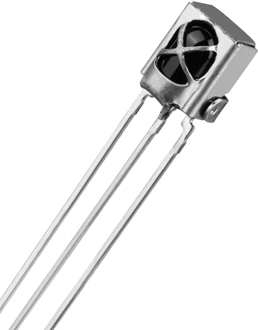
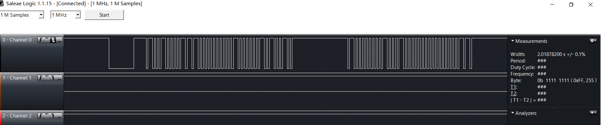
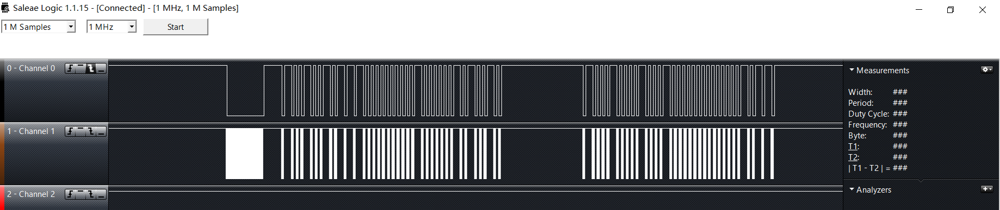
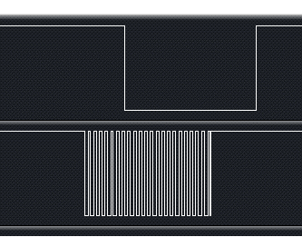

# 红外编码协议
本项目暂时只研究了格力空调遥控器(YBOF2)的编码协议，其他型号空调及遥控器可能不同，可能需要另行分析。

# 分析方式
为了准确模拟所使用空调遥控器的红外编码，需要通过实验进行验证。  
<div align=center></div>
使用如上图所示电路接收空调原装遥控器的红外信号，其中一体化红外接收头的OUT管脚通过上拉电阻接到5V电平。
接收到红外信号时，OUT管脚被拉低；否则上拉为高电平。
需注意，经过接收头接收之后已去除载波，但自己设计红外发射电路时，必须加上38KHz载波，否则接收头无法接收到红外信号。  
&nbsp;
<div align=center></div>


# 协议解析
经过试验观测，格力空调红外遥控器YB0F2所发射的红外信号波形如下图  
<div align=center></div>  
图中可以看出，该红外信号主要包括4个部分： 

1. 起始码(S):   9000us低电平 + 4500us高电平
2. 35bit数据码
3. 连接码(C):   600us低电平 +20000us高电平
4. 32bit数据码  

其中数据码电平格式为：  
0:  600us低电平 + 600us高电平  
1:  600us低电平 + 1600us高电平  

前35bit数据码：  

<div align="center">
<table border="1" cellspacing="0" cellpadding="0" width="100%">
<tr style="background:#C0C0C0;" align="center">
<td>1</td>
<td>2</td>
<td>3</td>
<td>4</td>
<td>5</td>
<td>6</td>
<td>7</td>
<td>8</td>
<td>9</td>
<td>10</td>
<td>11</td>
<td>12</td>
<td>13</td>
<td>14</td>
<td>15</td>
<td>16</td>
</tr>

<tr style="background:#C0CFC0;" align="center">
<td>1</td>
<td>0</td>
<td>0</td>
<td>1</td>
<td>0</td>
<td>0</td>
<td>1</td>
<td>0</td>
<td>1</td>
<td>1</td>
<td>1</td>
<td>0</td>
<td>0</td>
<td>0</td>
<td>0</td>
<td>0</td>
</tr>

<tr style="background:#FFFFFF;" align="center">
<td width="18.75%" colspan="3">模式标志</td>
<td width="6.25%">开关</td>
<td width="12.5%" colspan="2">风速</td>
<td width="7.25%">扫风</td>
<td width="6.25%">睡眠</td>
<td width="23%" colspan="4">温度数据</td>
<td width="25%" colspan="4">定时数据</td>
</tr>

<tr style="background:#C0C0C0;" align="center">
<td>17</td>
<td>18</td>
<td>19</td>
<td>20</td>
<td>21</td>
<td>22</td>
<td>23</td>
<td>24</td>
<td>25</td>
<td>26</td>
<td>27</td>
<td>28</td>
<td>29</td>
<td>30</td>
<td>31</td>
<td>32</td>
</tr>

<tr style="background:#C0CFC0;" align="center">
<td>0</td>
<td>0</td>
<td>0</td>
<td>0</td>
<td>0</td>
<td>1</td>
<td>0</td>
<td>0</td>
<td>0</td>
<td>0</td>
<td>0</td>
<td>0</td>
<td>1</td>
<td>0</td>
<td>1</td>
<td>0</td>
</tr>

<tr style="background:#FFFFFF;" align="center">
<td colspan="4">定时数据</td>
<td>加湿</td>
<td>灯光</td>
<td>负离子</td>
<td>节电</td>
<td>换气</td>
<td colspan="7">所有按键均显示此值</td>
</tr>

<tr style="background:#C0C0C0;">
<td>33</td>
<td>34</td>
<td>35</td>
<td width="76%" colspan="13"> </td>
</tr>

<tr style="background:#C0CFC0;">
<td>0</td>
<td>1</td>
<td>0</td>
<td width="76%" colspan="13"></td>
</tr>

<tr style="background:#FFFFFF;">
<td width="23%" colspan="3">所有按键均显示此值</td>
<td width="76%" colspan="13"></td>
</tr>

</table>
</div>

后32bit数据码：  

<div align="center">
<table border="1" cellspacing="0" cellpadding="0" width="100%">
<tr style="background:#C0C0C0;" align="center">
<td>36</td>
<td>37</td>
<td>38</td>
<td>39</td>
<td>40</td>
<td>41</td>
<td>42</td>
<td>43</td>
<td>44</td>
<td>45</td>
<td>46</td>
<td>47</td>
<td>48</td>
<td>49</td>
<td>50</td>
<td>51</td>
</tr>

<tr style="background:#C0CFC0;" align="center">
<td>1</td>
<td>0</td>
<td>0</td>
<td>0</td>
<td>1</td>
<td>0</td>
<td>0</td>
<td>0</td>
<td>0</td>
<td>1</td>
<td>0</td>
<td>0</td>
<td>0</td>
<td>1</td>
<td>0</td>
<td>0</td>
</tr>

<tr style="background:#FFFFFF;" align="center">
<td>上下扫风</td>
<td colspan="3"></td>
<td>左右扫风</td>
<td colspan="3"></td>
<td colspan="2">温度显示</td>
<td colspan="6">所有按键均显示此值</td>
</tr>

<tr style="background:#C0C0C0;" align="center">
<td>52</td>
<td>53</td>
<td>54</td>
<td>55</td>
<td>56</td>
<td>57</td>
<td>58</td>
<td>59</td>
<td>60</td>
<td>61</td>
<td>62</td>
<td>63</td>
<td>64</td>
<td>65</td>
<td>66</td>
<td>67</td>
</tr>

<tr style="background:#C0CFC0;" align="center">
<td>0</td>
<td>0</td>
<td>0</td>
<td>0</td>
<td>0</td>
<td>0</td>
<td>0</td>
<td>0</td>
<td>0</td>
<td>0</td>
<td>0</td>
<td>0</td>
<td>1</td>
<td>0</td>
<td>1</td>
<td>1</td>
</tr>

<tr style="background:#FFFFFF;" align="center">
<td colspan="10">所有按键均显示此值</td>
<td>节能</td>
<td></td>
<td colspan="4">校验码</td>
</tr>

</table>
</div>

上表中，大于两位的数据都采取“小端法”，低位在低地址（左），各数据的意义如下：  

|模式标志|自动|制冷|加湿|送风|制热|
|---|---|---|---|---|---|
|数据码|000|100|010|110|001|

|风速标志|自动|一级|二级|三级|
|---|---|---|---|---|
|数据码|00|10|01|11|

|温度|16度|17度|18~29度|30度|
|---|---|---|:---:|---|
|数据码|0000|1000|~|0111|


后32bit数据码中最后4bit为校验码，似乎不同型号的遥控器校验码不同，经过测试，我所使用的遥控器校验规则如下：  
```c
//校验码
void checkout()
{
	unsigned char check;
	check = IR_CodeBuf[1] + IR_CodeBuf[2]*2 + IR_CodeBuf[3]*4+IR_CodeBuf[4]*8;//模式
	check += IR_CodeBuf[9] + IR_CodeBuf[10]*2 + IR_CodeBuf[11]*4 + IR_CodeBuf[12]*8;//温度
	check += IR_CodeBuf[25];//换气
	check += IR_CodeBuf[40];//左右扫风
	check += IR_CodeBuf[62];//节能
	check += 12;
	check &= 0x0f;

	IR_CodeBuf[64] = check&1;
	IR_CodeBuf[65] = (check>>1)&1;
	IR_CodeBuf[66] = (check>>2)&1;
	IR_CodeBuf[67] = (check>>3)&1;
}

```
*这里稍微注意一下，我声明的协议码是68个元素的数组，实际上只用得到 1~67，其中IR_CodeBuf[0]没用，这是为了和我参考的一个博客上的下标相兼容*


# 软件模拟
*这一部分是之前用51单片机完成的，载波通过MCU内部定时器产生*  
通过软件模拟控制I/O口时序，并用逻辑分析仪检测波形  
将遥控器温度调为23度，发射红外光分析数据码，将此数据码作为软件模拟的初始化数据  
前35位数据码：1001 0010 1110 0000 0000 0100 0000 1010 010  
后32位数据码：1000 1000 0100 0100 0000 0000 0000 1011  
其中：  
Channel 1是sbit IR_LED=P2^4模拟的波形  
Chennel 0是一体化红外接收头接收到的波形  
<div align=center></div>  
局部放大：  
<div align=center></div>  


# 友情链接
[格力空调遥控器红外编码透析（长码） - CSDN博客](https://blog.csdn.net/yannanxiu/article/details/48174649)  
[红外遥控一体化接收头原理及应用1](http://www.360doc.com/content/14/0620/10/1437142_388278585.shtml)
