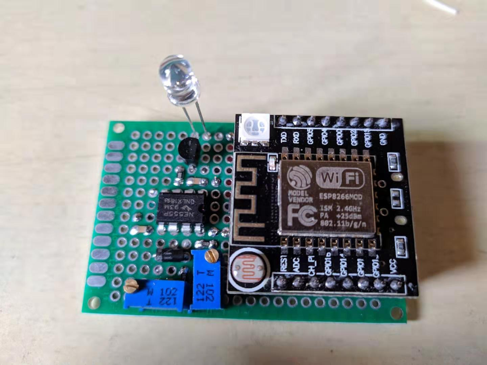
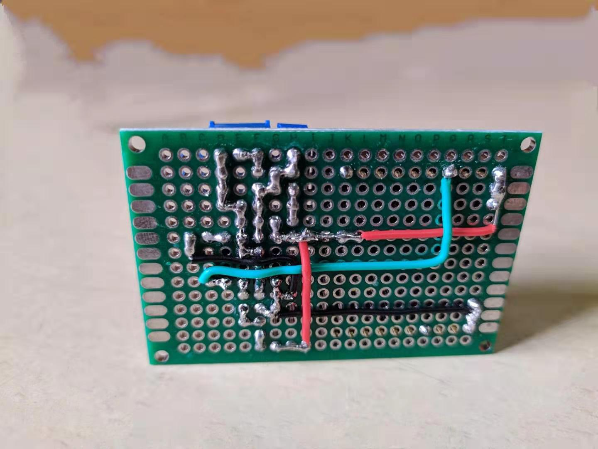
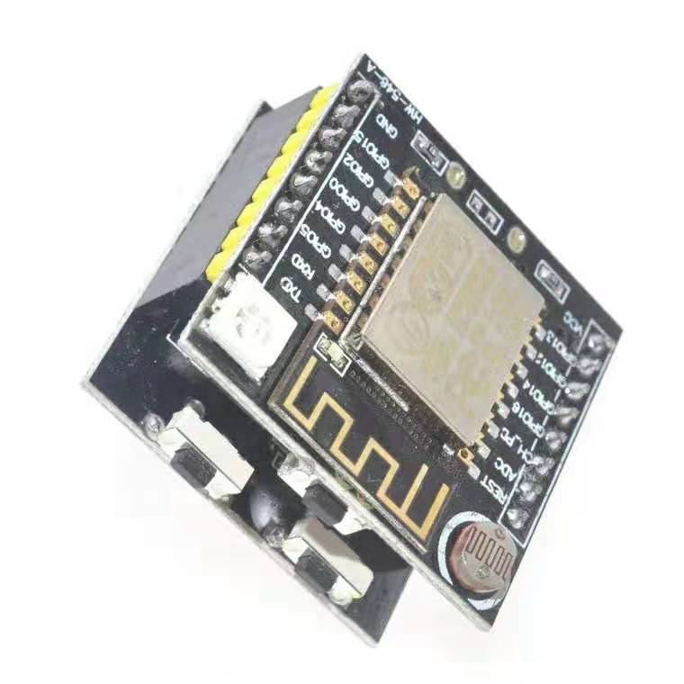
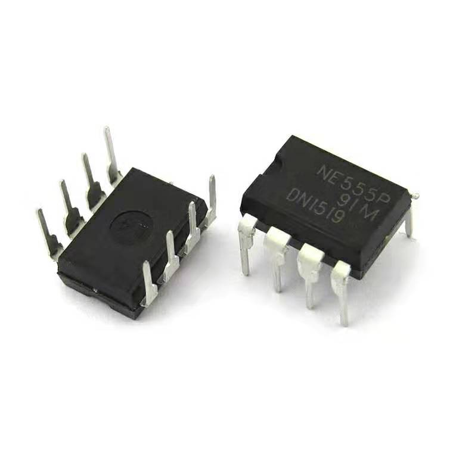
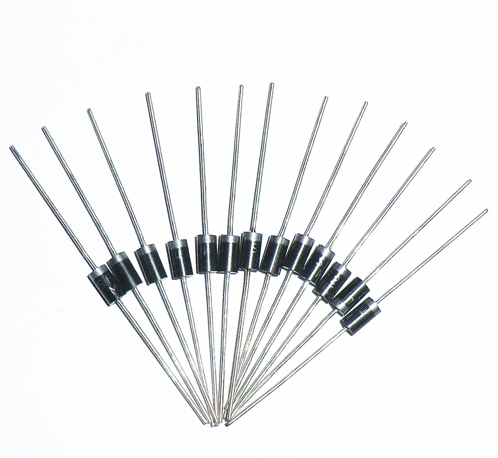
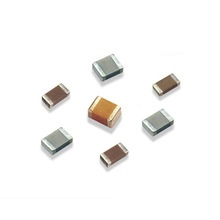
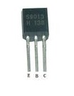
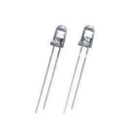
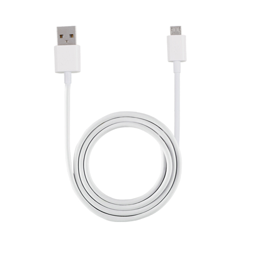

# RIRC 红外遥控器

# 产品说明
本产品是一个空调遥控器，可以通过移动端APP进行远程控制。其硬件底层是通过模拟原装空调遥控器的红外波形，从而实现对特定型号空调的控制(暂仅支持格力空调YB0F2型号遥控器)。  
使用时需要将本产品连接到WiFi网络，手机需要安装对应APP并连网(数据网络或者WiFi)，手机**无需**和本产品处于同一局域网环境。  

  

本产品的主要使用场景有： 

1. 手机本身不包含红外发射装置，但又希望能直接通过手机控制空调;
2. 希望在户外提前打开空调，待用户到达房间时，温度已经调节合适;
3. 使用传感器获取当前时间、房间温度、光照强度等参数，并通过软件实现自动控制(暂未实现).

# 开发环境/辅助软件
Windows10 + VirtualBox虚拟机(lubuntu)

Multisim12.0 + Fritzing0.9.0b

# 器件清单
|元件|功能|图片|补充说明|参考价格|
|:---|:---|:---:|:---|:---|
|ESP8266-12F|WiFi模块|

|俗称“小黑板”|&yen;30.96|   
|NE555|定时器|

|DIP-8封装|&yen;3.6/10个|
|整流二极管|振荡器辅助元件|

|便于调节占空比|&yen;5.5/100只|
|电阻、电容|振荡器辅助元件|

|0805贴片封装|&yen;3.7/100个|  
|多圈可调精密电位计|调节载波频率和占空比|

|3296W封装|&yen;2.31/5个|  
|NPN三极管|基本共射放大|

|9013|&yen;2.36/50个|  
|红外发光二极管|发射红外光信号|

|5mm|&yen;2.08/10个|
|数据线|供电|

|Micro-USB接口|&yen;10|
|洞洞板|电路载体|\*|7\*9cm|&yen;8.5/5片|  
|逻辑分析仪/示波器|辅助工具|\*|\*|\*|
|一体化红外接收头|辅助工具|\*|\*|\*|  

# 开发教程
如果你打算复现我的项目，可以参考以下文档：  
[格力空调红外协议](./Infrared_Protocol/readme.md)  
[红外信号载波](./Carrier_Wave/readme.md)  
[ESP8266开发教程](./ESP8266_Proj/readme.md)  

# 文件树结构
.  
├── README.md  
├── Carrier_Wave  
|   ├── readme.md  
|   └── images/  
├── Datasheet   
|   └── ne555.pdf  
├── ESP8266_Proj  
|   ├── readme.md  
|   ├── code_update.md  
|   ├── code_package/  
|   └── images/  
├── Fritzing_Proj  
|   ├── demo.fzz  
|   └── images/  
├── Images/    
├── Infrared_Protocol/  
├── Reference/  
└── Tools/  

# 后续改进
1. 555定时器的方波不太稳有一个很高的尖峰脉冲，可以在3口加一个104的电解电容，或者用7555替代 [百度知道](https://zhidao.baidu.com/question/617617286604112012.html)
2. 载波产生电路中用了两个电位计来调载波频率和占空比，因为占空比是1/2，所以可以将频率调为76KHz，然后用D触发器二分频，得到占空比始终为1/2的载波，这样可以省去一个电位计，减少电位计阻值改变而引起载波变化，且易于调节

# 补充说明
本产品开发过程中参考了网络上其他开发者的教程，特此致谢！  
部分图片资料等来源于网络，如有侵权，请联系本人删除！